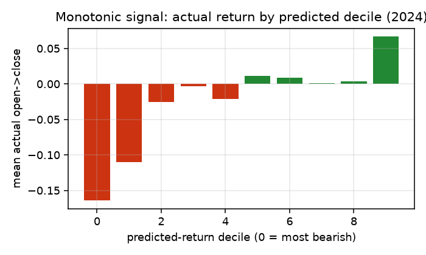
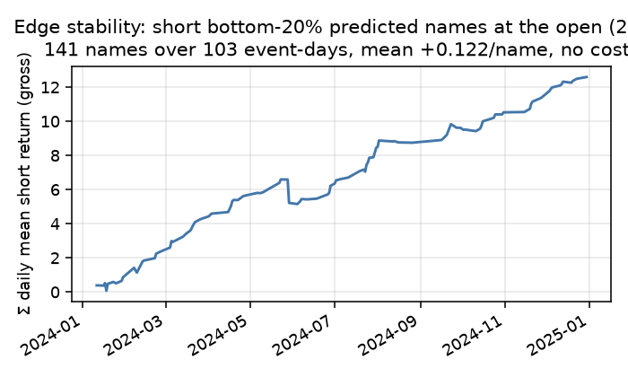
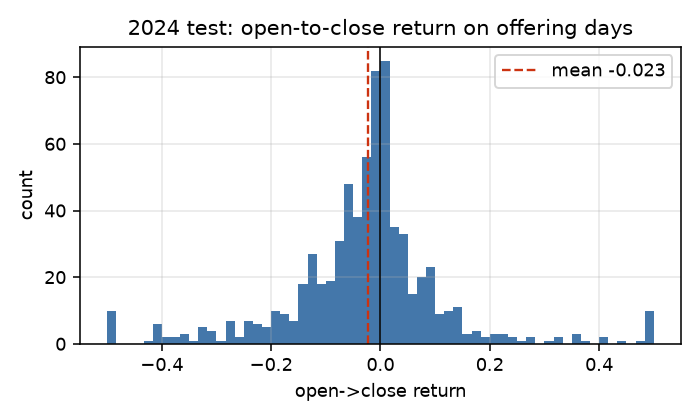

# QSG take-home: predicting open-to-close returns on offering-news days

## What I was asked to do

The dataset is centered on stock offerings: four years of anonymized news
headlines plus a daily price panel. The goal is to predict the **open-to-close
return** on days that carry **overnight news**, for a position entered at the
official open. The brief is explicit that news printed during the trading day
cannot be used to trade that day's open, so the whole exercise hinges on
assigning each headline to the correct session and never letting same-day
intraday information leak into the features.

I treated this as a supervised regression problem (predict the return) with a
directional classifier alongside it, and I evaluated it both as a forecasting
problem (MAE, R2) and as a trading problem (rank the names, trade the tails).

## The data

Five files: four yearly headline tables (`timestamp, symbol, headline, body`,
all NYC time) and one price panel (`date, symbol, open, high, low, close,
volume`).

The price panel only runs from **Nov 2021 to Dec 2024**. Most 2021 headlines
have no price to join against and drop out. After labeling and joining I am left
with **1,976 symbol-days across 1,309 tickers**. The names are overwhelmingly
small-cap dilutive issuers: registered directs, private placements, at-the-market
shelves, pre-funded warrant deals. The text skews heavily biotech and clinical.

The base rates matter for reading everything below. On the full sample the mean
open-to-close return is **-3.7%**, the median is **-1.7%**, and **61.7% of these
days close below where they opened**. An offering day is a structurally bearish
intraday event, so "short everything" is already a strong naive strategy and any
model has to be judged against that, not against a coin flip.

## Building the label (and keeping it clean)

This is where most of the care went.

**Session assignment.** Each headline timestamp is mapped to the open it could
first be traded on. If the news is stamped at or after 09:30 NYC it maps to the
**next** trading day's open; earlier news maps to the same day. Weekends and
holidays roll forward to the next available session. A 7:00am press release
trades on today's open; a 2:00pm release trades on tomorrow's.

**Aggregation.** When a ticker has more than one headline for the same target
session (about 5% of cases) I concatenate the text and take the last timestamp,
which feeds a `hours_before_open` feature (median 3.6 hours, 10th-90th
percentile 0.4 to 23.5 hours).

**Target.** `target_ret = (close - open) / open` on the assigned session.
`prior_close` is the previous *trading day's* close, taken by shifting one row
within each ticker's sorted price history, not by calendar date.

**Leakage controls.**

- Every fitted transform (TF-IDF vocabulary, the standard scaler, the target
  winsorization bounds, the per-column clip limits and median imputation values)
  is fit on the training split only and applied to the test split.
- Inside cross-validation this is enforced per fold, not just at the outer
  train/test boundary: alpha selection for ridge refits the TF-IDF vocabulary,
  scaler, and winsorization bounds on each fold's training rows only. Fitting
  those transforms once on the whole training set before splitting (the
  earlier version of this pipeline) doesn't leak into the 2024 test numbers,
  since the final model is still refit on train only, but it does let CV see
  validation rows through the transforms while picking alpha, which biases
  which alpha looks best.
- Cross-validation folds are grouped by `target_date`, not split by row.
  Up to 11 offerings can share a target date, and a plain row-wise
  `TimeSeriesSplit` can put some of a day's names in the training fold and
  others in the validation fold for that same day. Folds are now built by
  splitting the sorted unique dates and expanding back to rows, so no date
  straddles a fold boundary.
- The per-ticker history features (`offering_seq`, `symbol_avg_prior_ret`,
  `days_since_last_offering`) are built by walking the events in time order and
  only ever look at prior events for that ticker.
- Volatility and momentum use closing prices strictly before the target date.
- **`gap_pct` (open versus prior close) is excluded from the tradable model.**
  It's the one feature that uses target-day data, and on reflection it isn't
  just a mild leakage risk, it's a timing contradiction: the return being
  predicted is open-to-close, so the strategy has to be filled at the open.
  `gap_pct` can only be known once that open print exists, i.e. at the exact
  instant you'd need to already be filled. There's no version of "trade at the
  open" that gets to condition on the open. All headline numbers below use a
  **tradable** feature set that drops `gap_pct` (a market-on-open order placed
  before 9:30 using only overnight news and prior-day price history). A
  **non-tradable oracle** variant that keeps `gap_pct` is reported alongside
  it purely to show how much of the apparent edge was riding on that one
  feature — see Results.

## Features

**Text.** TF-IDF on `headline + body`, unigrams and bigrams, 500 features,
`min_df = 3`, English stop words. This is the bag-of-words baseline the brief
mentions. I did not use an LLM.

**Structured, about 16 columns plus keyword flags:**

| Group | Features | Why |
|---|---|---|
| Deal terms | `discount_pct` (parsed offer price vs prior close), `has_discount`, `log_dollar_amount` (parsed raise size, $M) | How dilutive and how cheap the deal is |
| Market context | `log_prior_close`, `vol_20d`, `mom_5d`, (`gap_pct`, oracle-only, not in the tradable model) | Where the stock is coming into the day |
| News shape | `n_news`, `hours_before_open`, `headline_len`, `body_len`, `dow` | How much time the market has had to digest |
| Issuer history | `offering_seq`, `has_prior_offering`, `symbol_avg_prior_ret`, `days_since_last_offering` | Serial diluters behave differently |
| Keywords | 22 binary flags: `registered direct`, `private placement`, `public offering`, `at the market`, `warrant`, `convertible`, `pre funded`, `reverse split`, `upsiz`, `terminat`, `dilut`, and others | Deal structure the TF-IDF may not isolate cleanly |

`discount_pct` and `log_dollar_amount` are pulled from the body with hand-written
regexes. The offer-price patterns skip warrant-exercise, par-value and debenture
contexts so they do not grab the wrong number. The raise-size pattern requires an
explicit `million`/`billion` unit or a spelled-out dollar figure, and caps the
result at $5B so a stray parse cannot dominate. A usable discount is extracted
for **41%** of rows; the rest get `discount_pct = 0` with the `has_discount = 0`
flag carrying the "we don't know" signal separately.

## Models

The brief suggests ridge, logistic regression, random forest or gradient
boosting on bag-of-words or TF-IDF. I ran all four and a blend:

- **Ridge** on text + structured features. `alpha` chosen by 4-fold,
  date-grouped `TimeSeriesSplit` cross-validation on the training set, with
  TF-IDF/scaler/winsorization refit inside each fold; it picked 300.
- **Random forest** and **gradient boosting** on the structured features only
  (trees do not benefit from the sparse TF-IDF block and it slows them down).
- **Blend** = 0.5 ridge + 0.5 gradient boosting, to combine the text signal
  with the non-linear structured signal.
- **Logistic regression** (class-balanced) for the up/down direction, scored
  separately.

Training targets are winsorized at the 2nd/98th percentile and predictions are
clipped to +/-0.75 so a handful of 100%+ moves do not dominate the fit or the
error metrics.

**Reproducibility.** One seed (`SEED = 0`) on every estimator and every
cross-validation split, and `n_jobs = 1` on the random forest. The pipeline
produces identical numbers on every run; I verified by running it twice and
diffing the output. `test_train_eval.py` and `test_robustness_check.py` are
small runnable checks on the two bugs this pipeline used to have (date-fold
grouping, the zero-baseline directional-accuracy metric) and on the
bootstrap helper, so a future edit that reintroduces either bug fails a
check instead of silently changing the reported numbers.

## Results

All headline numbers below use the **tradable** feature set (no `gap_pct` —
see Leakage controls). A non-tradable **oracle** column that keeps `gap_pct`
is shown alongside for reference only.

### Holdout: train on everything before 2024, test on 2024 (n = 707)

| Model | MAE | R2 | Directional acc | R2 (oracle, w/ gap_pct) |
|---|---|---|---|---|
| Predict 0 | 0.102 | -0.02 | n/a — see note | - |
| Predict train mean | 0.106 | -0.02 | 0.60 | - |
| Always short (sign only) | - | - | 0.60 | - |
| Gap continues (not tradable) | 0.113 | -0.29 | 0.45 | - |
| Ridge | 0.097 | 0.101 | 0.60 | 0.102 |
| Random forest | 0.094 | 0.082 | 0.61 | 0.044 |
| Gradient boosting | 0.096 | 0.094 | 0.59 | 0.073 |
| **Blend** | **0.095** | **0.112** | **0.59** | 0.104 |

Note on "Predict 0": directional accuracy is `mean(sign(y_true) ==
sign(y_pred))`, and `sign(0) == 0` essentially never matches `sign(y_true)`
for a continuous target, so this baseline used to print 0.0099 — a wall the
comparison never had a chance of clearing, not a meaningful baseline.
`directional_accuracy` now excludes predictions of exactly zero from the
denominator (returns `NaN` here rather than a near-zero score), and the fair
sign baseline is "always short" — predict every name negative, which nets
60% here just from the base-rate skew. It's already effectively present as
the "predict train mean" row (train mean is negative, so its sign is always
"short"), now called out on its own row.

Logistic direction: AUC **0.63**, accuracy 0.58 against a majority-class
baseline of 0.61.

The blend explains ~11% of out-of-sample variance and beats every naive
baseline on MAE and R2. Its blanket directional accuracy sits at/under the
majority-class ("always short") baseline of 60%, which is the point made
earlier: an offering day is structurally bearish, so the model earns its keep
on **magnitude and ranking**, not on calling every sign.

**Dropping `gap_pct` barely moves these numbers** (blend R2 0.112 vs. 0.104
oracle; random forest actually improves without it). The apparent edge was
never really coming from "the open already moved" — it's coming from the
deal terms and text. That's the concrete answer to "what happens to page 7
once you make execution realistic": not much, because the untradable feature
wasn't doing much work in the first place.

### Walk-forward check

Refitting the whole pipeline once per test year (tradable feature set):

| Test year | n_train | n_test | MAE | R2 | Directional acc |
|---|---|---|---|---|---|
| 2023 | 566 | 703 | 0.104 | 0.112 | 0.62 |
| 2024 | 1269 | 707 | 0.095 | 0.112 | 0.59 |
| Pooled | - | 1410 | 0.099 | 0.116 | 0.61 |

The two out-of-sample years agree, which is the main thing I wanted to see given
how small the sample is.

### Ranking quality: realized return by predicted decile (2024)

{width=90%}

Sorting the 2024 test set by predicted return produces a clean monotone
gradient in *realized* return. The most-bearish decile averages **-16%**
open-to-close; the most-bullish averages **+6%**. This is the property that
matters for trading: the model orders the names correctly even where it is not
precise about the exact number.

### Trading the tails: short the bottom quintile at the open

Each day, short the 20% of names with the lowest predicted return, equal weight,
enter at the open, exit at the close, using the **tradable** model's ranking
(predicted before the open, no `gap_pct`). These are **gross** returns, no
costs, and still assume a fill at the official opening print — see
Limitations for why that fill assumption itself is optimistic for this
name of stock.

| Window | Names per leg | Mean short return | Hit rate |
|---|---|---|---|
| 2024 | 141 | **+13.7%** | 82% |
| Pooled 2023-24 | 282 | **+14.6%** | 79% |

(Oracle, with `gap_pct`, 2024: +13.7% mean short return, 82% hit rate —
essentially identical, reinforcing that `gap_pct` wasn't carrying the tail
signal.)

The long leg is weak (+3.5% in 2024) and trading *every* name by predicted sign
loses money. The edge is concentrated in the short tail. Overnight language like
"registered direct", "warrant", "units", "public offering" and a positive
`mom_5d` (a recent run-up reversing on the offering) predicts that the stock
bleeds through the session as the freshly priced supply gets absorbed.

{width=90%}

The cumulative curve is close to linear across 2024, so this is not one or two
lucky months.

### Is this signal or noise?

Given how small this sample is, I checked rather than assumed.

- **Permutation test.** Refit ridge 200 times on the training set with the
  target column randomly shuffled (breaking any real train/test
  relationship), scored each against the real, unshuffled 2024 test set.
  The real model's test R2 is **0.101**; the null distribution from 200
  shuffles has mean **-0.034**, std **0.019**, and a max of **0.019** across
  all 200 shuffles. The real result exceeds every single permutation. A
  pipeline with no genuine signal essentially never produces 0.101 this way.
- **Block bootstrap by trading day.** Individual same-day offerings aren't
  independent draws, so I resampled whole `target_date`s (not rows) with
  replacement, 1000 times, on the tradable blend's 2024 predictions. 95% CI
  on test R2: **[0.042, 0.181]** (R2 <= 0 in 0.2% of draws). 95% CI on the
  short-leg mean PnL: **[0.093, 0.178]** (never <= 0 across 1000 draws).
- **Hyperparameter sanity.** `alpha=300` (the CV-selected ridge penalty) is
  a genuine interior optimum, not an artifact of a narrow search grid — CV
  R2 rises from 0.071 at alpha=3 to a peak of 0.105 at alpha=300 and falls
  to 0.015 by alpha=10000 when the grid is extended. The 0.5/0.5 ridge/GBM
  blend weight is also close to CV-optimal (peak CV R2 at ridge weight
  0.4-0.5, essentially tied, versus 0.113 at pure GBM and 0.105 at pure
  ridge) — the blend ratio wasn't arbitrary, it's near the best mix
  available from these two models.

Reproduce with `python robustness_check.py` (writes `output/robustness.json`).

This doesn't turn a real-but-modest effect into a large one — R2 of ~0.11 on
daily single-stock returns is a small effect in absolute terms, and it
should be: a much higher number here would be a leakage red flag, not a
reason for confidence. But it's a small effect that's reliably above zero
across resampling and far outside what a no-signal pipeline produces by
chance, not something indistinguishable from noise.

### What the model keys on

Largest ridge coefficients (tradable model, no `gap_pct`):

- **Negative, predicts a drop:** `registered direct`, `warrant`, `units`,
  `public offering`, a positive `mom_5d` (a recent run-up tends to reverse on
  the offering), `ipo`, `vol_20d`, `convertible`.
- **Positive, predicts a smaller drop or a bounce:** `discount_pct` (larger =
  less discount to prior close = smaller drop — see below), `log_prior_close`
  (higher priced, less speculative names hold up better), `hours_before_open`
  (more time to digest the news), `private placement`, `symbol_avg_prior_ret`,
  `log_dollar_amount`.

Among the 41% of rows with a parsed offer price, `discount_pct` correlates
**+0.35** with the target: the deeper the discount to the prior close, the
harder the stock falls that session.

{width=90%}

## Limitations and what I would do next

- **Costs.** Every trade number here is gross. These are hard-to-borrow
  micro-caps; borrow fees, slippage and market impact would take a large bite,
  and the occasional short squeeze is a real fat left tail on the P&L. The next
  step is a cost model and a borrow-availability filter.
- **Fill assumption.** The trading numbers still assume a fill at the official
  opening print, even after fixing the feature-timing issue (dropping
  `gap_pct`). The tradable model's *ranking* is legitimately knowable before
  9:30 — it uses only overnight news and prior-day price history, so a
  market-on-open order can be submitted with that ranking in hand. But the
  fill itself, for a 20%-of-day-volume opening auction in a thin,
  freshly-diluted micro-cap, is not going to land exactly on the printed open
  the way a large-cap fill would; auction depth here is genuinely uncertain
  without book/auction data this dataset doesn't have. The daily OHLC panel
  has no intraday prices, so there's no way to substitute a "fill 1-5 minutes
  after open" price from this data — that would be the next thing to source.
  Treat the reported open-to-close return as the trade's economic exposure,
  not as a guaranteed execution price.
- **Extraction noise.** Offer price and raise size are regex heuristics. 59% of
  rows have no parsed discount and are imputed. A small parser or an LLM
  extraction pass would recover more of that signal cleanly.
- **Sample size.** About 1.3k training rows and 700 test rows, one clean test
  year. 2021 is mostly unusable because the price panel starts in November.
  Confidence intervals on R2 and hit rate are wide.
- **Direction below the majority baseline.** The model adds value in the tails
  and on magnitude, not on blanket sign. A model built specifically to rank
  (pairwise or quantile loss) would likely do better on the trading objective.
- **No LLM features.** TF-IDF plus keyword flags carry the text signal here; an
  embedding or a structured extraction of deal terms is the obvious upgrade.
